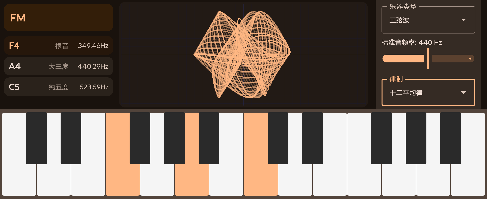
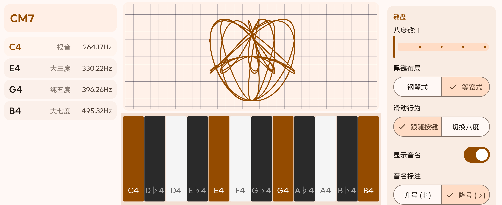

# 和弦示波器

一款安卓平台的和弦示波器。在虚拟钢琴键盘上演奏（或连接 MIDI 键盘），实时观察波形相互作用产生的利萨如图形，同时应用会识别和弦并显示各音的信息。

[English](README.md)





## 功能

- **虚拟钢琴键盘** — 钢琴式或等宽布局，多指触控指间独立，滑动跟随/滑动切八度双模式，选配音名标注，可调八度范围
- **实时示波器** — 任意数量同时演奏音符的旋转投影利萨如图形，单音显示波形、双音经典利萨如、三音及以上采用等角旋转投影。轨迹可选渐变淡出，长度可调
- **和弦识别** — 识别三和弦、七和弦、九和弦、挂留、加音和弦，显示音名、相对根音的音程和频率，支持转位识别
- **三种律制** — 十二平均律、纯律、五度相生率，标准音频率 415--466 Hz 可调
- **四种波形** — 正弦波、方波、三角波、锯齿波
- **MIDI 输入** — 支持 USB 和蓝牙 MIDI 设备
- **Material You 设计** — Android 12+ 动态取色，暗色主题，双布局模式（方屏适合手机，宽屏适合平板和横屏）
- **中英文双语** — 完整国际化支持

## 系统要求

- Android 14 (API 34) 或更高版本
- MIDI 输入需要 USB-OTG 或蓝牙 MIDI 设备

## 构建

```bash
git clone https://github.com/doubao/oscillochord.git
cd oscillochord
./gradlew :app:assembleDebug
```

Debug APK 路径：`app/build/outputs/apk/debug/app-debug.apk`。

## 架构

MVVM + Clean Architecture，使用 Kotlin 和 Jetpack Compose 构建。

```
app/src/main/java/me/doubao/oscillochord/
├── MainActivity.kt               # 单 Activity，锁定横屏
├── ui/
│   ├── theme/                     # Material 3 暗色主题 + 动态取色
│   ├── screen/                    # MainScreen（双布局模式）
│   ├── keyboard/                  # PianoKeyboard + KeyboardViewModel
│   ├── oscilloscope/              # OscilloscopeView + OscilloscopeViewModel
│   ├── info/                      # InfoPanel + InfoViewModel（和弦识别）
│   └── settings/                  # SettingsPanel + SettingsViewModel
├── domain/
│   ├── audio/                     # AudioEngine (AudioTrack)、Oscillator、Waveform
│   ├── chord/                     # ChordDetector、ChordDatabase、PitchUtils、TuningSystem
│   ├── lissajous/                 # LissajousProjector（旋转投影）
│   └── midi/                      # MidiInputManager
└── data/
    └── SettingsRepository.kt      # DataStore 偏好存储
```

### 技术栈

| 组件 | 库 |
|------|-----|
| UI | Jetpack Compose + Material 3 (BOM 2025.06) |
| 音频 | `android.media.AudioTrack`（无 NDK 依赖） |
| 状态 | Kotlin StateFlow + Compose `collectAsStateWithLifecycle` |
| 持久化 | DataStore Preferences |
| 并发 | Kotlin Coroutines |
| MIDI | `android.media.midi` (API 23+) |

### 关键设计决策

- **音频引擎**运行在单一长期协程中，向常开 `AudioTrack` 实例写入数据。无音符时写入静音以消除启动延迟，平滑归一化因子防止增减振荡器时的音量跳变。
- **示波器**使用独立的视觉振荡器，由 Compose 的 `withFrameNanos` 驱动而非音频缓冲区速率。每帧为每个活跃振荡器生成 256 个采样点，投影到二维后绘制为连续路径。
- **八度滑动**在拖拽时追踪像素级偏移，松手后根据释放速度计算落点并吸附到最近八度边界，使用 `tween` 动画实现惯性。
- **和弦识别**支持转位——以每个演奏的音为候选根音，将得到的音高类别集合与模板数据库匹配。

## 许可

MIT
